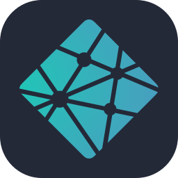

<table border="0">
  <tr>
    <td width="320" valign="top">
      
    </td>
    <td valign="top">
      <h1>👋 I'm Janani!</h1>
      <h3>✨ Aspiring ML Engineer | Web Developer ✨</h3>
      
    </td>
  </tr>
</table>

---

## 📖 About Me:

<table border="1">
  <tr>
    <td width="50%">
      <h3>✅ Pros</h3>
      <ul>
        <li><b>ML Wizard:</b> Can turn messy data into meaningful insights.</li>
        <li><b>Bug Hunter:</b> Won't sleep until that one extra semi-colon is found.</li>
        <li><b>Learning Machine:</b> Acquires new tech stacks faster than a <code>pip install</code>.</li>
      </ul>
    </td>
    <td width="50%">
      <h3>⚠️ Cons</h3>
      <ul>
        <li><b>Dark Mode Addict:</b> Might hiss if forced to use a light-themed IDE.</li>
        <li><b>Optimization Freak:</b> Will spend 3 hours to automate a 30-second task.</li>
        <li><b>Tab Hoarder:</b> 50+ Chrome tabs open is a "minimalist" setup.</li>
      </ul>
    </td>
  </tr>
</table>

---

## 🛠️ My Tech Stack (Local Assets)

### Web Development

  
  
  
  
  
  

### Machine Learning & Data Science

  
  
  
  
  

### Languages & Databases

  
  
  
  
  

### Tools & Deployment

  
  
  
  
  

---
## 📊 My GitHub Statistics

  
  

---

## 🤝 Connect with Me!

---
